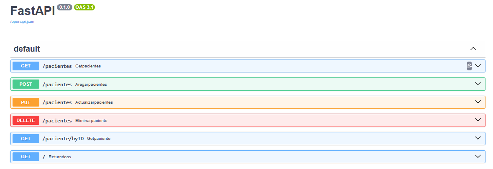
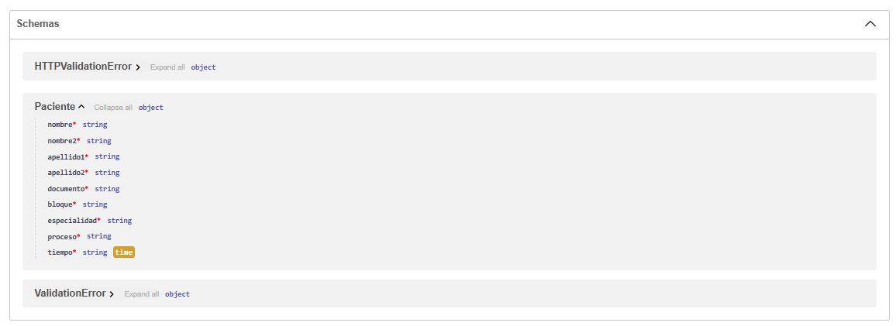

# API de Gestión de Pacientes

Este documento describe los endpoints disponibles en la API de gestión de pacientes.

## Endpoints


## Schemas



### 1. Obtener Pacientes

- **Método:** `GET`
- **Ruta:** `/pacientes`
- **Descripción:** Recupera una lista de pacientes. Puedes especificar el número máximo de pacientes a devolver mediante el parámetro `numero`.
- **Parámetros de consulta:**
  - `numero` (opcional): Número máximo de pacientes a devolver. Por defecto es 15.
- **Respuesta Exitosa (200 OK):**
  - **Tipo:** `List[Paciente]`
  - **Ejemplo:**
    ```json
    [
      {
        "nombre": "Juan",
        "nombre2": "Carlos",
        "apellido1": "Pérez",
        "apellido2": "Gómez",
        "documento": "123456789",
        "bloque": "A",
        "especialidad": "Cardiología",
        "proceso": "Consulta",
        "tiempo": "12:00:00"
      },
      ...
    ]
    ```

### 2. Agregar Paciente

- **Método:** `POST`
- **Ruta:** `/pacientes`
- **Descripción:** Agrega un nuevo paciente a la base de datos.
- **Cuerpo de la Solicitud:**
  - **Tipo:** `Paciente`
  - **Ejemplo:**
    ```json
    {
      "nombre": "Ana",
      "nombre2": "María",
      "apellido1": "Gómez",
      "apellido2": "Martínez",
      "documento": "987654321",
      "bloque": "B",
      "especialidad": "Neurología",
      "proceso": "Revisión",
      "tiempo": "15:30:00"
    }
    ```
- **Respuesta Exitosa (201 Created):**
  - **Tipo:** `Paciente`
  - **Ejemplo:**
    ```json
    {
      "nombre": "Ana",
      "nombre2": "María",
      "apellido1": "Gómez",
      "apellido2": "Martínez",
      "documento": "987654321",
      "bloque": "B",
      "especialidad": "Neurología",
      "proceso": "Revisión",
      "tiempo": "15:30:00"
    }
    ```

### 3. Obtener Paciente por ID

- **Método:** `GET`
- **Ruta:** `/paciente/byID`
- **Descripción:** Recupera un paciente específico por su documento de identificación.
- **Parámetros de Consulta:**
  - `documento` (requerido): Documento de identificación del paciente.
- **Respuesta Exitosa (200 OK):**
  - **Tipo:** `Paciente`
  - **Ejemplo:**
    ```json
    {
      "nombre": "Juan",
      "nombre2": "Carlos",
      "apellido1": "Pérez",
      "apellido2": "Gómez",
      "documento": "123456789",
      "bloque": "A",
      "especialidad": "Cardiología",
      "proceso": "Consulta",
      "tiempo": "12:00:00"
    }
    ```
- **Respuesta de Error (404 Not Found):**
  - **Detalle:** "Paciente no encontrado"

### 4. Actualizar Paciente

- **Método:** `PUT`
- **Ruta:** `/pacientes`
- **Descripción:** Actualiza la información de un paciente existente.
- **Cuerpo de la Solicitud:**
  - **Tipo:** `Paciente`
  - **Ejemplo:**
    ```json
    {
      "nombre": "Juan",
      "nombre2": "Carlos",
      "apellido1": "Pérez",
      "apellido2": "Gómez",
      "documento": "123456789",
      "bloque": "A",
      "especialidad": "Cardiología",
      "proceso": "Consulta",
      "tiempo": "12:00:00"
    }
    ```
- **Respuesta Exitosa (200 OK):**
  - **Tipo:** `Paciente`
  - **Ejemplo:**
    ```json
    {
      "nombre": "Juan",
      "nombre2": "Carlos",
      "apellido1": "Pérez",
      "apellido2": "Gómez",
      "documento": "123456789",
      "bloque": "A",
      "especialidad": "Cardiología",
      "proceso": "Consulta",
      "tiempo": "12:00:00"
    }
    ```

### 5. Eliminar Paciente

- **Método:** `DELETE`
- **Ruta:** `/pacientes`
- **Descripción:** Elimina un paciente de la base de datos basado en el documento de identificación.
- **Parámetros de Consulta:**
  - `documento` (requerido): Documento de identificación del paciente.
- **Respuesta Exitosa (200 OK):**
  - **Tipo:** `dict`
  - **Ejemplo:**
    ```json
    {
      "detail": "Usuario eliminado exitosamente"
    }
    ```
- **Respuesta de Error (404 Not Found):**
  - **Detalle:** "Paciente no encontrado"

## Estructura del Objeto Paciente

El objeto `Paciente` tiene el siguiente formato:

- **nombre**: `str` - Primer nombre del paciente.
- **nombre2**: `str` - Segundo nombre del paciente (opcional).
- **apellido1**: `str` - Primer apellido del paciente.
- **apellido2**: `str` - Segundo apellido del paciente (opcional).
- **documento**: `str` - Documento de identificación del paciente.
- **bloque**: `str` - Bloque o ubicación del paciente.
- **especialidad**: `str` - Especialidad médica del paciente.
- **proceso**: `str` - Proceso asociado con el paciente.
- **tiempo**: `time` - Hora asociada con el paciente.

